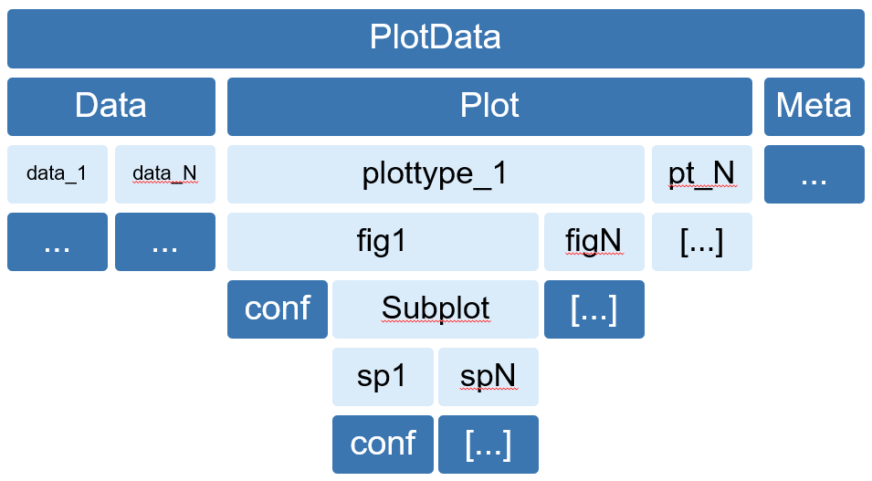

Developer Guide
================

Generating `.mat` Files
------------------------
.. _data_files:

In order to be capable of generating the needed MATLAB data files, it is crucial
to understand the underlying data structure.
Here is a quick overview of the structure:

    *Data structure*

This image shows the hierarchy of the data structure. **PlotData** is the name of the whole structure when imported into
Matlab. Inside this structure the variables **Data**, **Plot** and **Meta** are stored. The fields coloured in pink can
be assigned dynamically, while the blue fields are required. It is possible to assign any amount of plotting types below
**Plot** the same way it is possible to have any amount of data objects in **Data**. Inside the data objects, the actual
data is stored together with its name and unit. It is possible to display given data in different ways, so different
plots can be created under **Plot**. For each type, any amount of figures can be created. It is possible to customize
the figure. Parallel to the figure config, any amount of subplots can be assigned. Each subplot can then be further
customized.
Below is an example of how to create such a tree in python:

.. code-block:: python

    d1 = {'plot_data': {'data': {'raw_force': {'values': raw_force, 'name': 'Raw Force', 'unit': 'N'},
                                 'current': {'values': current, 'name': 'Current', 'unit': 'A'},
                                 'raw_voltage': {'values': raw_voltage, 'name': 'Raw Voltage', 'unit': 'V'},
                                 'rad': {'values': rad, 'name': 'rad', 'unit': 'm'},
                                 'theta': {'values': theta, 'name': 'theta', 'unit': 'rad'},
                                 't_incremental': {'values': t_incremental, 'name': 'Time incremental', 'unit': 's'},
                                 'hist': {'values': x_hist, 'name': 'hist', 'unit': 'IQ'}},

                        'meta': {'timestamp_last_sample': 12345.6789,
                                 'location': 'Deutschland, Oberkochen',
                                 'machine': 'bla',
                                 'worker': 'Max Mustermann'},

                        'plot': {'raw': {'figure': [{'subplot_cols': 2,
                                                     'subplot_rows': 2,
                                                     'subplot': [{'plots': [['t_incremental', 'raw_force'],
                                                                            ['t_incremental', 'current']],
                                                                  'x_label': 'X-Axis of Plot 1',
                                                                  'plot_type': 'LinLin',
                                                                  'title': 'subplot 1',
                                                                  'legend': 'lower left'},

                                                                 {'plots': [['t_incremental', 'raw_voltage']],
                                                                  'plot_type': 'LinLog'},
                                                                 {'plots': [['t_incremental', 'raw_force']],
                                                                  'grid': False},
                                                                 {'plots': [['t_incremental', 'raw_voltage']]}]},

                                                    {'subplot_rows': 2,
                                                     'subplot': [{'plots': [['t_incremental', 'raw_voltage']]},
                                                                 {'plots': [['t_incremental', 'current']],
                                                                  'regression': 'Root'}]},

                                                    {'subplot': [{'plots': [['theta', 'rad']],
                                                                  'plot_type': 'Polar',
                                                                  'title': 'example polar Plot'}]},

                                                    {'subplot_cols': 2,
                                                     'subplot': [{'plots': ['hist'],
                                                                  'plot_type': 'Hist',
                                                                  'title': 'example for histogram',
                                                                  'bins': 20,
                                                                  'x_label': 'IQ'},

                                                                 {'plots': ['hist'],
                                                                  'plot_type': 'Hist',
                                                                  'title': 'example for second histogram',
                                                                  'bins': 50,
                                                                  'x_label': 'IQ'}]}],
                                         'linkaxes': [[0, 0], [0, 2], [1, 0]]}}}}

This example is very verbose, but it shows the most common configuration options. Because this dictionary will be
written as a Matlab file first, everything has to be a dictionary or a list. A dictionary will be interpreted as a
struct in Matlab, a list will become a vector and vice versa. The variables *raw_force*, *current*, ... are numpy arrays
in which the plot data is stored in. Each of these data arrays can be viewed as an axis. It is possible to plot every
one of these axes over each other. It is required to define *name* and *unit* too. **Meta** stores the meta values,
giving them is also required. In the above example only one key (*raw*) is given. It is however possible to specify more
than one. Inside this key, the different figures can be defined. The figure configs are stored inside a list, so the
figures can later be indexed correctly. This list is a list of dictionaries, where each dictionary represents the
configuration for a figure.

.. code-block:: python

    [{fig1}, {fig2}, {fig3}, ...]

Inside those dictionaries it is required to specify the *subplots* key, which is a again a
list of dictionaries, where each dictionary represents a subplot.

.. code-block:: python

    [{sp1}, {sp2}, {sp3}, ...]

For the subplots it is only required to set the
*plots* key, which specifies which axes should be plotted over each other. Normally this has to be a two dimensional
list, that can contain as many plots as liked. Each item of the list has to be a list with two items.

.. code-block:: python

    [[ax_1, ax_2], [ax_1, ax_2], [ax_1, ax_2], ...]

Those items are of type string and are the names of the data objects specified in **Data**. The only exception are plots
of type *hist*, these only require one axis. The plot type of each subplot can be specified
with the *plot_type* parameter.

Creating Additional Plot Types
-------------------------------
.. _developer:

Additional plot types can be added in the :ref:`DataAnalyzer.PlotConfig.PlotTypes <plottypes>`
package. A plot type module must have the following syntax:

.. code-block:: python

    plt_YourCustomPlotType.py

And the contained class's name must then be:

.. code-block:: python

    YourCustomPlotType

Typically each plot type inherits its `__init__` method from the `plot_Base` module,
which contains the :ref:`Base <plt_base>` class. The most basic configuration is taken there.

Additionally plot types that have a very basic configuration can inherit the `plot` method from the
:ref:`DataAnalyzer.PlotConfig.TwoD.plt_TwoD <plt_twod>` module.

You can however define the constructor and `plot` methods yourself. You have to minimally include these two methods,
because they get called by the program.

.. warning::
    Watch out that you take all possible configuration arguments in
    the `__init__` method, or else an error will be thrown

The `plot` method is required. If you define it yourself, make sure it takes two additional arguments,
because the program will call it that way.
The first argument gets assigned a Matplotlib axes object, which can be understood as a subplot. By changing it's
properties, the subplot can be customized. The second argument will be an object of
`DataAnalyzer.Data.cl_data.FileData.plot_data.Data`
which contains the actual plotting data (:ref:`reference <cl_data>`). You will have to index it with the correct
name. The following is the `plot` method from :ref:`DataAnalyzer.PlotConfig.TwoD.plt_TwoD <plt_twod>` module.

.. code-block:: python

    def plot(self, ax, data):
        if not isinstance(self.plots[0], list):
            self.plots = [self.plots]

        for plot in self.plots:
            ax.plot(asarray(data[plot[0].strip()].values),
                    asarray(data[plot[1].strip()].values),
                    label=data[plot[1].strip()].name)

        ax.set_xlabel(self.x_label)
        ax.set_ylabel(self.y_label)
        ax.set_title(self.title)
        ax.legend(loc=self.legend)
        ax.grid(self.grid)

        try:
            self.plot_specific(ax)
        except AttributeError:
            pass

The `plot` method is responsible for plotting the data onto the axes object that was created before.
As you can see, `plot` tries to call the function `self.plot_specific`, which can be defined by the child class of it.
That way you would not need to define the whole `plot` method, but could just add the parameters you were missing.
Some specific plot types like polar plots require configuration when creating the axes object. The way this is handled
can be seen in the next code example from the :ref:`plt_polar <plt_polar>` module.

.. code-block:: python

    def plot(self, ax, data):
        ax = subplot(projection='polar')

        if not isinstance(self.plots[0], list):
            self.plots = [self.plots]

        for plot in self.plots:
            ax.plot(asarray(data[plot[0].strip()].values),
                    asarray(data[plot[1].strip()].values),
                    label=data[plot[1].strip()].name)

        ax.set_xlabel(self.x_label)
        ax.set_ylabel(self.y_label)
        ax.set_title(self.title)
        ax.legend(loc=self.legend)
        ax.grid(self.grid)

This specific `plot` method doesnt use the given axes object, but rather creates a new one. If this is the case, it is
not possible to link the axes object with other ones. This behaviour is because linkaxes relies on the previously
created axes objects. For further information check :ref:`this <cl_plot>` out.