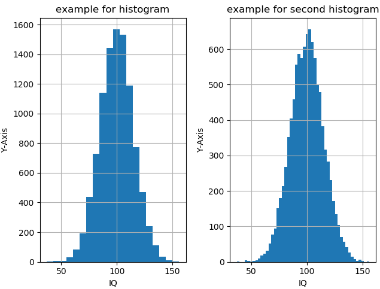

Overview
=========
This program can be used to plot and then analyze data.
The data is given to a program over a `.mat` file. Examples of plots are shown below:

.. figure:: images/fig1.png
    :alt: Example fig1

    *Example figure 1 with standard plot types*

.. figure:: images/fig2.png
    :alt: Example fig2

    *Example figure 2 with root regression*

.. figure:: images/fig3.png
    :alt: Example fig3

    *Example figure 3 polar plot*

    *Example figure 4 histogram*

Additional plot types can easily implemented, see developer guide.